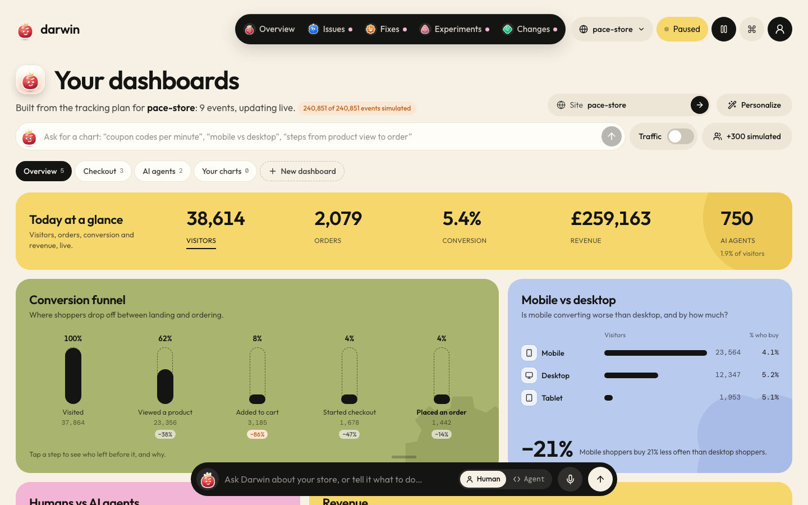
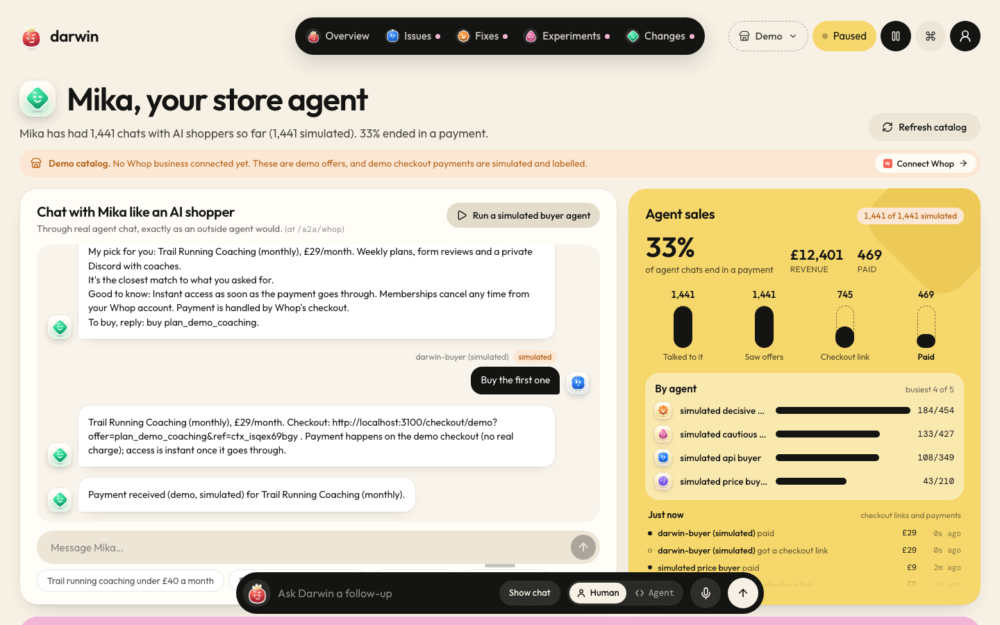
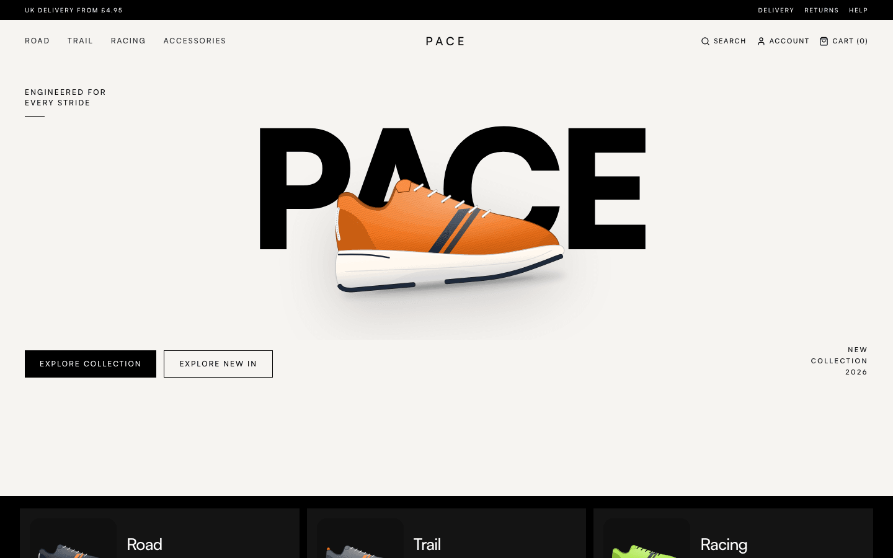
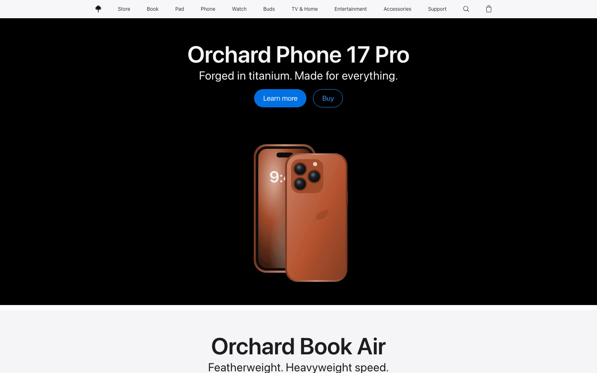

# Darwin

**A storefront that learns from every visit.**

Darwin watches how people and AI agents shop your store, then fixes what stops them buying.


## The problem in one minute

- Online stores lose buyers to small things: a shipping cost that shows up too late, a confusing button, a slow checkout.
- AI shopping agents now shop and buy for people. They get stuck on different things than people do, like missing stock or delivery details.
- Fixing this means testing one change at a time and waiting for the numbers. Nobody running a store has time to test every idea.

## What Darwin does

Darwin runs a small crew of AI helpers that go round and round the same loop:

1. **Iris watches.** She follows how shoppers and AI agents move through the store and finds where they get stuck.
2. **Darwin finds what stops them.** The lead picks the problem that loses the most buyers and runs the team.
3. **Pixel drafts a fix.** A small page change, like showing the delivery cost up front.
4. **Fizz tests it.** Half the shoppers see the old page (A), half see the new one (B). Fizz picks the winner.
5. **Dash ships the winner.** The better page goes live for everyone, and Dash can undo it at any time.

Then the loop starts again on the next problem.

Two more teammates:

- **Mika** is the store's own AI sales agent. She sells to AI shoppers by chatting with them.
- **Grok** sends you a short morning briefing on how the store is doing.

## Screenshots

**Landing page.** What Darwin is, with a live preview of the console.


**Setup.** Describe your store in one line, connect it, and Darwin plans what to watch.


**Overview.** How much better the store sells since Darwin started, for people and for AI agents.


**Issues.** Iris lists what stops shoppers buying, biggest problem first.


**Fixes.** Pixel's page changes, each one tied to the problem it solves.


**Tests.** Fizz compares the old page with the new one and shows the chance the new one is better.


**Changes.** Every change Dash shipped, with a way to undo it.


**Dashboards.** Charts Darwin builds for you from what you said you care about.



**Store agent.** Chat with Mika the way an AI shopper would, and see how many agent chats end in a sale.



**Demo shop.** PACE, a running shoe store Darwin improves in the demo.



**Ask Darwin.** Type or talk to the crew from any page. They answer from your store's numbers and can do things for you.


**Traffic.** Where visitors come from, including which AI assistants send shoppers.


**Personalize.** Change a page for one traffic source or search, and test it the same way.


**Agent readiness.** Paste any store's address and see what AI shoppers can and can't do there.


**Demo websites.** Two stores with planted mistakes for Darwin to find and fix: an Apple style store and a Fleek style store. See [demo-websites](demo-websites/).




## Try it in 2 minutes

1. Open the landing page and click **Set up your store**.
2. Click **Skip, explore with the demo store**. It fills with simulated shoppers.
3. Go to **Overview** in the console.
4. Press **Watch Darwin fix it** at the top and watch the crew find a problem, draft a fix, test it and ship the winner.

## How it works

For technical judges:

- **One Next.js app.** The store, the console and the API all live in `apps/web`.
- **The loop.** Watch, find the problem, draft a change, run an A vs B test, ship the winner, repeat. Every change is small and can be undone.
- **Simulated shoppers, clearly labelled.** Simulated people and AI agents react to the real page they are shown. Every number from them says "simulated".
- **Built for AI agents.** AI shoppers can search, check stock, add to cart, haggle and buy through agent tools (MCP) and agent chat (A2A).
- **Works with no API keys.** Every AI step has built in rules to fall back on, so the demo runs without any keys.

## Run it

```bash
cd apps/web
cp .env.example .env.local
npm install
npm run dev
```

Then open http://localhost:3000.

Keys, GitHub, Whop, Telegram, the command line tool, the MCP server and everything else: see [docs/SETUP.md](docs/SETUP.md).

## Honest notes

- Shopper numbers in the demo come from simulated shoppers, and the app labels them as simulated everywhere.
- Real stores send real visits through the same loop. The demo simply makes it fast enough to watch in 2 minutes.
