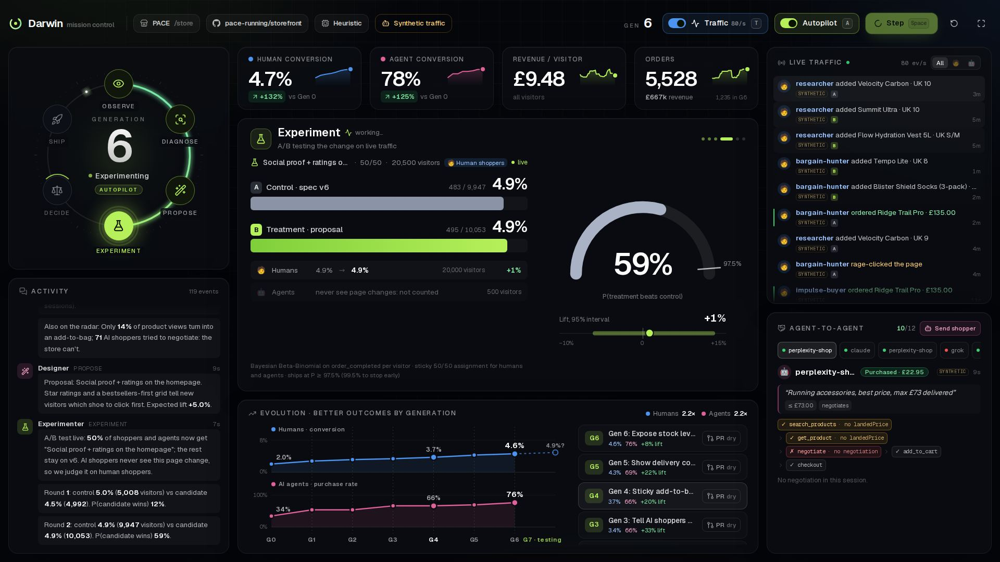
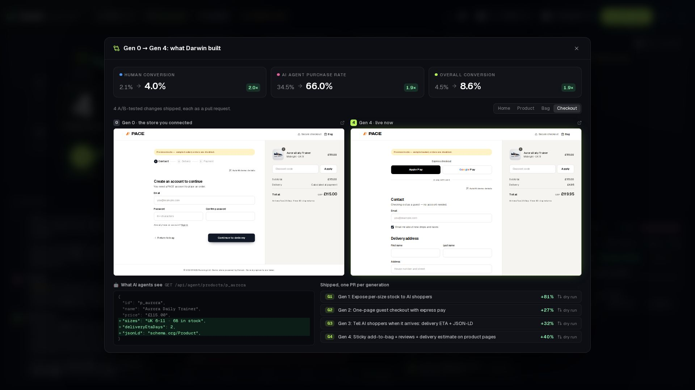
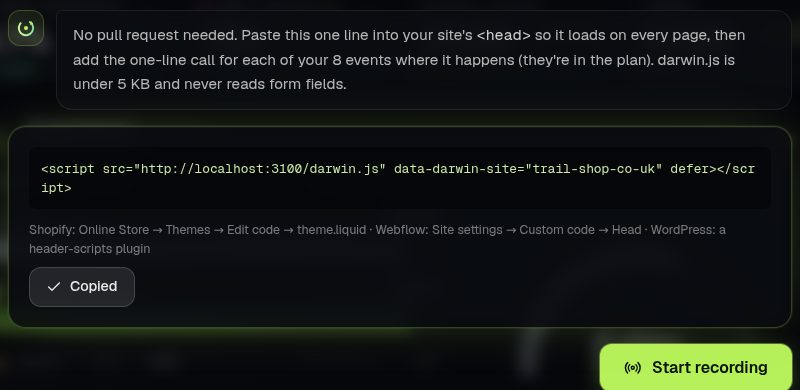
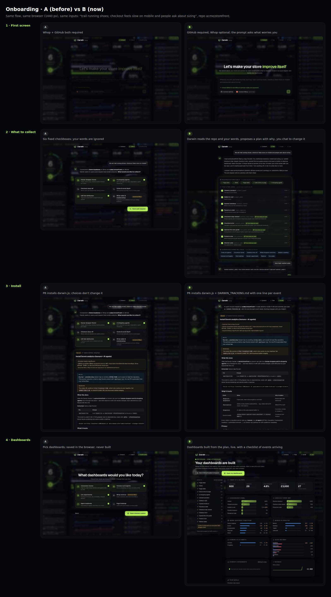
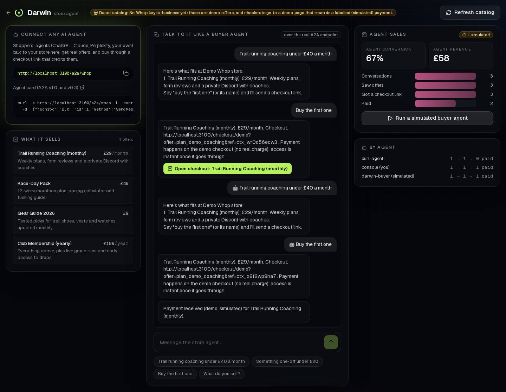
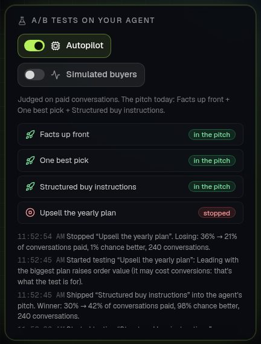
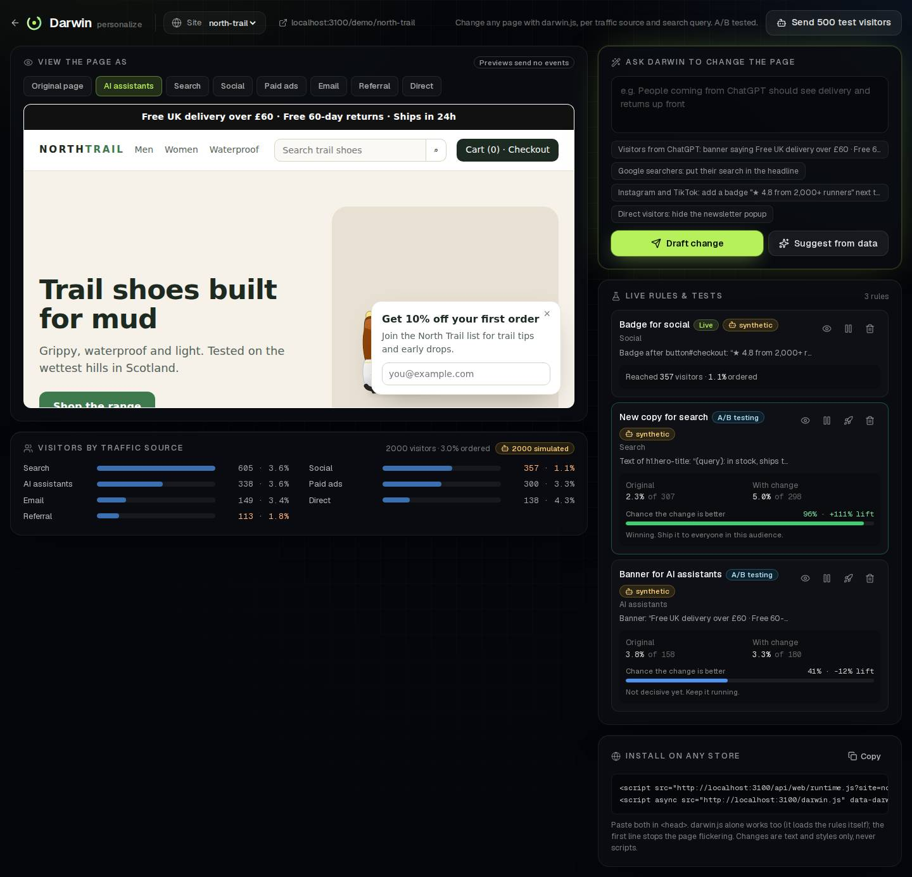

# Darwin — the storefront that improves itself

Cursor Commerce London Hackathon, 26 Sep 2026.

Darwin connects to a store's git repo and installs analytics through a PR. It watches how **humans and AI
shopping agents** move through the store, finds where they drop off, proposes a page change, A/B tests it, and
ships the winner as a new PR. Then it starts again.

```
 behaviour ──► insight ──► page change ──► A/B test ──► ship PR ──┐
     ▲                                                              │
     └──────────────────────── next generation ◄───────────────────┘
```





## Run it (2 minutes)

```bash
cd apps/web
npm install
npm run build && npm start     # or: npm run dev
```

| URL | What |
|---|---|
| http://localhost:3000 | Landing page |
| http://localhost:3000/onboarding | **Set up a store**: tell Darwin about it, connect GitHub, or paste one script tag (+ Whop) → it plans what to record, installs it, builds your dashboards |
| http://localhost:3000/console | **Mission control**: the loop, live traffic, experiments, PRs |
| http://localhost:3000/console/dashboards | The dashboards Darwin built from a store's tracking plan, live |
| http://localhost:3000/console/agents | **Store agent**: your Whop store's AI agent (A2A at `/a2a/whop`), a live buyer-agent chat, agent sales |
| http://localhost:3000/console?mock=1 | Same UI, fully simulated in the browser (offline fallback) |
| http://localhost:3000/store | The demo store (PACE running shoes) |
| http://localhost:3000/console/personalize | **Personalize any store**: change a page per traffic source (ChatGPT, Google, Instagram, ads) and search query, A/B tested |
| http://localhost:3000/demo/north-trail | A plain-HTML store Darwin didn't build (only the darwin.js tag), used to show personalization on "any store" |
| http://localhost:3000/llms.txt | What AI agents read about the store |
| `POST /api/mcp` | MCP server for AI shoppers (search, availability, cart, negotiate, checkout) |
| `POST /api/a2a` | A2A merchant agent (v1.0 and v0.3): buyer agents shop and haggle in plain English |

All API keys are optional (`apps/web/.env.example`). With no keys the loop uses its heuristic playbook and GitHub PRs
are dry-run previews. See [docs/LOCAL_TESTING.md](docs/LOCAL_TESTING.md) for testing with an LLM and a real GitHub token,
and [docs/DEMO.md](docs/DEMO.md) for the 3-minute demo script.

## How it works

| Piece | Where | What it does |
|---|---|---|
| **PageSpec** | `src/lib/contracts/page-spec.ts`, `apps/web/storefront.config.json` | Declarative description of the store: human UI *and* agent surface. Every change Darwin makes is a validated patch to it. |
| **Storefront** | `src/app/store/**` | PACE store rendered from the PageSpec. Every setting visibly changes the page. |
| **Agent commerce** | `src/lib/agent-commerce/**` | MCP + REST tools for AI shoppers, an A2A merchant agent that chats and negotiates within margin limits, `llms.txt`, agent card. |
| **Analytics** | `src/lib/analytics/**` | PostHog-compatible ingest (`/ingest`, used by posthog-js), human vs AI-agent classification, funnels, friction signals. |
| **Simulator** | `src/lib/simulator/**` | Synthetic shoppers (5 personas) and AI agents whose behaviour depends only on the page they're served. Labelled `synthetic`. |
| **Optimizer** | `src/lib/optimizer/**` | The loop: diagnose → propose → Bayesian A/B test → decide → ship. LLM (Grok/Claude/OpenRouter) or heuristic playbook. |
| **GitHub** | `src/lib/github/**` | Connect a repo → PR installing `darwin.js`; each winner → PR editing `storefront.config.json`. |
| **Web personalization** | `src/lib/web/**` | Rules that change any page running darwin.js (text, banner, badge, hide, style) per traffic source and search query. Drafted from plain English (LLM or heuristic), A/B tested with arms recomputed server-side. |
| **Console** | `src/app/console/**` | Mission control for the demo. |

### Example run (heuristic mode, synthetic traffic; exact results vary run to run)

| Gen | Change Darwin shipped | Audience | Result |
|---|---|---|---|
| 0 | Baseline | | humans 2.1%, agents 35% |
| 1 | Expose per-size stock to AI shoppers | agents | +65% |
| 2 | One-page guest checkout with express pay | humans | +53% |
| – | Low-stock urgency (wildcard) | humans | inconclusive, shelved |
| 3 | Delivery ETA + JSON-LD for agents | agents | +20% |
| 4 | Sticky add-to-bag + reviews + delivery estimate | humans | +27% |
| 5 | **Let AI shoppers negotiate** (merchant agent, ≤10% off, never below floor) | agents | +6.5% |
| 6 | Show delivery cost upfront + free delivery over £60 | humans | +29% |
| 7 | Stock levels + returns policy for agents | agents | +5.4% |
| 8 | Quote landed price to agents | agents | +6.7% |

Overall conversion (at the Gen 0 traffic mix) goes 4.5% → 10.4%: humans about 2.1% → 4.4%, agents 35% → 87%. Shipping needs ≥97.5% posterior probability (99.5% to stop early), and bad ideas are
rejected and never retried.

### Onboarding: Darwin asks, installs, builds your dashboards

1. **Connect**: describe the store in one line ("trail running shoes; checkout feels slow on mobile") and connect its
   GitHub repo (Whop is optional and adds payments).
2. **Plan**: Darwin reads the repo (framework, site id) and your words, and proposes a tracking plan with a reason for
   every event: automatic ones darwin.js records with no code, the shopping funnel, and events for *your* worry
   (checkout steps and errors, sizing, search…). Change it by chatting ("also track wishlist adds", "don't track
   rage clicks") or with toggles; the dashboards update as you go.
3. **Install**: one pull request adds darwin.js and commits the plan as `DARWIN_TRACKING.md`, with the one line each
   event needs.
4. **Live**: the dashboards are built from the plan and fill as events arrive, with a checklist of what's been
   recorded. Simulated shoppers are available for a demo, and always labelled.

**No GitHub?** Two other ways in:

- **One script tag.** In the GitHub drawer, pick *Add one script tag instead* and give the store's address. The plan is
  the same; the install step is one line to paste into the site's `<head>` (Shopify, Webflow, WordPress, any site you
  can edit) instead of a pull request.
- **Whop only, no code.** The store agent (`/console/agents`) sells your Whop plans to AI shoppers with nothing to
  install. Payments come back through the Whop webhook.



Darwin runs on its own onboarding (site `darwin-onboarding`): each step is an event, so its funnel shows up in
`/console/dashboards?site=darwin-onboarding` and can be A/B tested like any store.



### Your Whop store's own AI agent (agent-to-agent commerce)

How an AI agent buys from the store, and how Darwin knows it converted:

1. A shopper's agent (ChatGPT, Claude, Perplexity, a custom buyer) finds the store agent at `/a2a/whop`
   (agent card at `/a2a/whop/agent-card.json`; A2A v1.0 `SendMessage` and v0.3 `message/send`).
2. It asks in plain English ("trail running coaching under £40 a month") and gets real offers from the Whop
   business's plans (price, billing) as text plus structured data.
3. "Buy the first one" returns a **Whop checkout link tagged with the conversation** (checkout configuration
   metadata: `visitor_kind: agent`, `agent_name`, `darwin_ref`).
4. The Whop payment webhook (`/api/whop/webhook`) brings the payment back with that metadata, so it counts as
   that agent's sale. `/console/agents` shows the funnel: conversations → offers → checkout links → paid, by agent.

Set `WHOP_API_KEY` and `WHOP_COMPANY_ID` (biz_…). Until then it runs on a labelled demo catalog whose checkout
records a simulated payment.



**A/B tests on the agent's pitch.** Darwin tests how the store agent sells, one lever at a time, judged on paid
conversations (sticky per conversation, Bayesian, ships at ≥97% chance better):

| Lever | What changes in the reply |
|---|---|
| Facts up front | Instant access, cancel any time, paid on Whop (text + a `facts` array) |
| One best pick | One recommendation with the reason instead of a list |
| Structured buy instructions | Exact offer ids and `reply "buy <id>"` in the data part |
| Upsell the yearly plan | Leads with the biggest plan |

Winners ship into the pitch and stack; the next lever is tested on top. Turn on **Autopilot** in `/console/agents`
(it starts labelled simulated buyer agents if there's no traffic yet). API: `GET/POST /api/store-agent/tests`.



### Personalize any store

The loop above optimizes a store built on a PageSpec. Web personalization works on **any** store with the darwin.js tag:

1. Tell Darwin what to change: *"Visitors from ChatGPT: banner with delivery and returns"*, *"Google searchers: put their
   search in the headline"*. It drafts a rule against the page's real elements (or suggests one per traffic source,
   biggest conversion gap first).
2. Preview it as each audience, then start an A/B test (or show it to everyone in that audience).
3. darwin.js loads `/api/web/runtime.js?site=…`, which sorts each visitor by source (AI assistant, search, social,
   paid, email, referral, direct) and search query, assigns a sticky arm, and applies the change with `textContent` and
   styles only (never HTML or scripts), without flicker.
4. Results count orders after exposure, with each visitor's arm recomputed on the server.
5. **Autopilot** runs this loop by itself: one A/B test per traffic source (biggest conversion gap first, up to 3 at
   once), ships a winner at ≥97% with ≥300 visitors per arm and ≥30 orders, stops losers, then tries that source's
   next idea. It never retries an idea, and every decision is logged with its numbers.
6. **Heatmap**: darwin.js already records clicks (`$autocapture`, `$rageclick`); flip *Heatmap* to see where each
   audience clicks, painted over the page (same-origin previews) and listed (any store), rage clicks in red.



### Talk to the store's agents

The store is agent-ready: `GET /llms.txt` and `GET /.well-known/agent-card.json` describe it. What agents are told
always follows the live PageSpec, so Darwin's changes reach them as well.

```bash
# A2A (v1.0): chat with the merchant agent; reuse the contextId from the reply to continue
curl -s localhost:3000/api/a2a -H 'content-type: application/json' -d '{"jsonrpc":"2.0","id":1,"method":"SendMessage",
  "params":{"message":{"role":"ROLE_USER","messageId":"m1","parts":[{"text":"Trail shoes, UK 10, under £150, by Friday"}]}}}'

# MCP (Streamable HTTP): Cursor / Claude Code can connect directly
claude mcp add --transport http pace-store http://localhost:3000/api/mcp

# A scripted buyer agent chatting over A2A, in the terminal
npx tsx scripts/a2a-buyer.ts --url http://localhost:3000
```

### Telegram

Text Darwin from Telegram.

- **Allowlisted chats** (`TELEGRAM_ALLOWED_CHAT_IDS`) go through `runAssistant`, the same function as the console assistant (`POST /api/assistant`). Every message can ask a question or act: step the loop, check experiments, ship a winner, turn autopilot on, reset. Shipping, autopilot and reset wait until you reply `yes` or `no`. Any other reply cancels that prompt.
- **No allowlist:** messages stay on the Overview Ask Darwin chat (`ask()`, `POST /api/ask`) and only answer questions. `/help` says tool use is off. Set the allowlist before you expect the bot to change anything.

1. In Telegram, open [@BotFather](https://t.me/BotFather), send `/newbot`, and copy the bot token.
2. Pick a webhook secret: 1–256 characters, only `A–Z`, `a–z`, `0–9`, `_` and `-` (for example `openssl rand -hex 32`).
3. On the Vercel project for [usedarwin.app](https://usedarwin.app), set:
   - `TELEGRAM_BOT_TOKEN` — the token from BotFather
   - `TELEGRAM_WEBHOOK_SECRET` — the secret from step 2
   - `TELEGRAM_ALLOWED_CHAT_IDS` — your chat id (comma-separated if several). Required for stepping the loop, shipping, and other tools. Leave it empty and the bot only answers questions. Set `0` first if you don't know the id yet: the bot replies once with it.
4. Redeploy so the new env vars are live.
5. Register the webhook (this calls Telegram `setWebhook` for `https://usedarwin.app/api/telegram` and sends the secret):

   ```bash
   cd apps/web
   TELEGRAM_BOT_TOKEN='…' TELEGRAM_WEBHOOK_SECRET='…' npm run telegram:setup
   ```

   Or, after the redeploy, if `DARWIN_ADMIN_TOKEN` is set on Vercel:

   ```bash
   curl -H "Authorization: Bearer $DARWIN_ADMIN_TOKEN" https://usedarwin.app/api/telegram
   ```

6. Open the bot and send `/start`. Then try `How is conversion?` or, once your chat id is on the allowlist, `Step the loop`.

If `TELEGRAM_ALLOWED_CHAT_IDS` is set and your chat is not on it, the bot replies **once** with your chat id. Add that id, redeploy, and message again. Leave the variable empty only for a question-only bot: anyone who finds it can spend the LLM key on answers, and it will not run tools. With the allowlist set, those chats can act, so keep the list to yourself.

### Agent mode: ⌘K, WebMCP and `window.darwin`

Everything Darwin can do is one typed command (`apps/web/src/lib/commands`): a zod input (also served as JSON
Schema), a description written for an LLM, and a risk. Three things share it:

- **⌘K (Ctrl+K)** anywhere in `/console`: type in plain words ("build a dashboard of coupon usage per hour for
  trail-shop", "send 200 shoppers then step the loop", "roll back to gen 3", "why are agents leaving?") or pick a
  suggestion. `POST /api/command { text, page }` turns the words into a plan (the LLM when a key is set, else a
  deterministic parser), every step is validated, and the steps run as a live checklist. Rollback and ship/stop
  ask you first, inline.
- **WebMCP**: when the browser exposes the proposed W3C `navigator.modelContext`, the same commands are registered
  as tools (`darwin_navigate`, `darwin_build_dashboard`, `darwin_rollback`, …), so an AI agent running in your
  browser can drive Darwin with no CLI or MCP server. Tools that change what shoppers see still stop for a human
  in the page.
- **`window.darwin`** for automation and devtools:

```js
window.darwin.commands                       // ["navigate", "build_dashboard", "simulate_traffic", …]
window.darwin.manifest()                     // names, descriptions, risk, JSON Schemas
await window.darwin.run("simulate_traffic", { humans: 200, agents: 20 })  // → { ok, text, href?, data? }
await window.darwin.plan("roll back to gen 2")                             // plan only, nothing runs
await window.darwin.do("send 200 shoppers then open the top issue")        // plan + run (confirms still ask)
```

`GET /api/command` returns the registry (admin-gated like the rest of mission control). Numbers in results come
from Darwin's APIs, and simulated traffic is always labelled.

### Drive Darwin with an agent: MCP server and CLI

The same commands also run headless (`lib/commands/server-run.ts`), through Darwin's own API routes, so any
agent can drive the whole console: create dashboards and personalizations, send shoppers, step the loop, browse
every page, ask questions, ship or roll back.

- **MCP server** at `/api/darwin/mcp` (Streamable HTTP, JSON-RPC). Tools: `darwin_state` (loop, KPIs, running
  tests), `darwin_pages` (every page with its URL), `darwin_whats_left` (the roadmap) and every command as
  `darwin_<name>`. Risky tools (`darwin_rollback`, `darwin_act_on_briefing`) first return the question to ask the
  merchant; they run only when called again with `confirm: true`.

```bash
# Claude Code (add --header "Authorization: Bearer $DARWIN_ADMIN_TOKEN" when a token is set)
claude mcp add --transport http darwin http://localhost:3000/api/darwin/mcp
```

```json
// Cursor: ~/.cursor/mcp.json
{ "mcpServers": { "darwin": { "url": "http://localhost:3000/api/darwin/mcp",
  "headers": { "Authorization": "Bearer <DARWIN_ADMIN_TOKEN, if set>" } } } }
```

- **CLI** (`apps/web/scripts/darwin.ts`, no extra dependencies). `DARWIN_URL` defaults to
  `http://localhost:3000`; `DARWIN_TOKEN` is the admin key. Add `--json` for machine output.

```bash
cd apps/web
npm run darwin -- commands                                      # every command and its risk
npx tsx scripts/darwin.ts state                                 # loop, KPIs, running tests
npx tsx scripts/darwin.ts run simulate_traffic --humans 200 --agents 20
npx tsx scripts/darwin.ts run build_dashboard --json '{"request":"coupon usage per hour","site":"trail-shop-co-uk"}'
npx tsx scripts/darwin.ts do "send 200 shoppers then open the top issue"   # plans, then runs each step
npx tsx scripts/darwin.ts run rollback --generation 2 --yes     # risky: asks y/N unless --yes
npx tsx scripts/darwin.ts open experiments                      # prints the page's URL
```

### Honest notes

- **Security:** mission control and every state-changing API (loop, GitHub PRs, simulator, LLM shoppers, raw
  analytics) can sit behind `DARWIN_ADMIN_TOKEN` (sign in at `/console?key=…`). It's optional: without it the
  console is open, public deploys included, and anyone with the URL can drive the loop and spend the LLM key. Browser
  events can't claim to be synthetic or pick an experiment arm (attribution is re-derived server-side), and ingest is
  size- and rate-limited.
- **Simulated traffic in the demo:** the demo runs on simulated traffic, labelled everywhere. The simulator's behaviour model is
  documented in `src/lib/simulator/behavior-model.ts`, and `GET /api/simulate` returns it.
- **Stricter bar for early stops:** experiments stop early only at 99.5% certainty; the final round uses 97.5%.
- **Single process:** state lives in memory plus `apps/web/.data/`. Run one process for the demo.

See [AGENTS.md](AGENTS.md) for module ownership and conventions, and
[docs/posthog-extraction.md](docs/posthog-extraction.md) for what we took from PostHog.
