# Darwin: the store that improves itself

Darwin watches how people and AI shopping agents (ChatGPT, Claude, Gemini, Grok, Perplexity) move through an online
store, finds what stops them buying, and tests a fix. When the fix wins, Darwin ships it, and it can undo it in one click.
More and more shopping is done by AI agents, and most stores are not built for them, so Darwin works on both at once.

**[Live demo](https://darwin-production-7899.up.railway.app)** ·
[Demo websites](demo-websites/) ·
[3-minute demo script](docs/DEMO.md) ·
[What works and what's left](docs/STATUS.md)

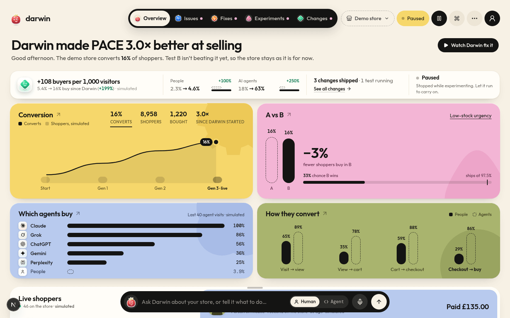

<sub>Every number in these screenshots comes from simulated shoppers in a local run, and the app labels them
"simulated". In that run Darwin shipped 5 changes to the demo store and the share of shoppers who bought went from 3.2%
to 7.3%. Results change from run to run.</sub>

## How it works

1. **Watch.** A small script (`darwin.js`) records what shoppers do. Darwin tells people and AI agents apart.
2. **Find the problem.** It ranks what stops people buying by buyers lost per 1,000 visits, for people and for agents.
3. **Draft a fix.** Each fix is a small change to the page's settings, written by an LLM or by Darwin's own playbook
   when no key is set. It only uses facts already on the page.
4. **Test it.** Half the shoppers see the current page, half see the new one. Darwin ships only when it is at least
   97.5% sure the new version is better (99.5% to stop a test early).
5. **Ship the winner.** The change goes live, and when the store's code is on GitHub, Darwin opens a pull request.
6. **Undo.** Every change can be rolled back, and a losing idea is never tried again.

Then it starts again. A crew of agents does the work, one job each:

| Agent | Job |
|---|---|
| **Darwin** (lead) | Talks to you and runs the team. |
| **Iris** (watcher) | Finds where people and AI shoppers get stuck. |
| **Theo** (designer) | Drafts page changes from facts already on your page. |
| **Ada** (tester) | Tests the new version against the current page and picks the winner. |
| **Max** (shipper) | Ships the winner as a code change, and can undo it. |
| **Mika** (store agent) | Sells to AI shoppers on your Whop store, with a checkout link for each sale. |
| **Grok** (teammate) | Reads Darwin's briefing and messages you when there's a call to make. |

## A tour of the product

### Landing page

The front door: what Darwin does, a small live dashboard (running on simulated shoppers, and labelled so), the crew,
and links to set up a store, open the console, check a store's agent readiness or visit the demo store.

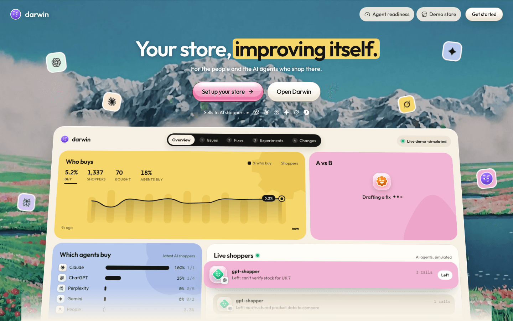

### Set up a store

Say what you sell and what worries you in one line. Then connect a GitHub repo (Darwin opens a pull request that adds
its script), or paste one script tag into any site. Whop is optional. Darwin proposes what to record and why, and builds
your dashboards from that plan. **Skip, explore with the demo store** opens the console on the demo store instead.

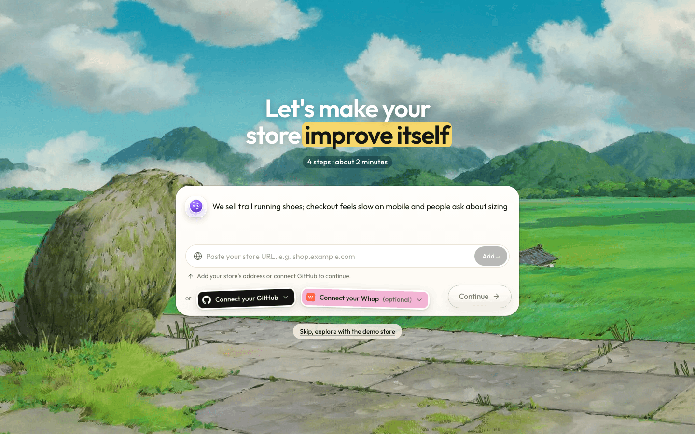

### Overview

How the store is doing now against before Darwin started: conversion per version, the A vs B test that is running,
which AI agents buy, and where people and agents drop out. **Watch Darwin fix it** plays one full round of the loop.
(The screenshot at the top of this page.)

### Issues

What stops shoppers buying, ranked by buyers lost per 1,000 visits, with who is affected (people or AI agents), where
it happens, what Iris saw, and which fix is being tested for it.

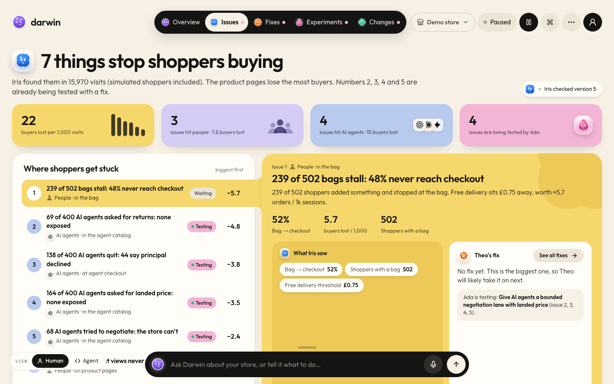

### Fixes

Every fix Theo drafted, with the exact settings it changes ("in words" or "as code"), which issues it answers, who wrote
it (an LLM or the playbook), and how its test is going.

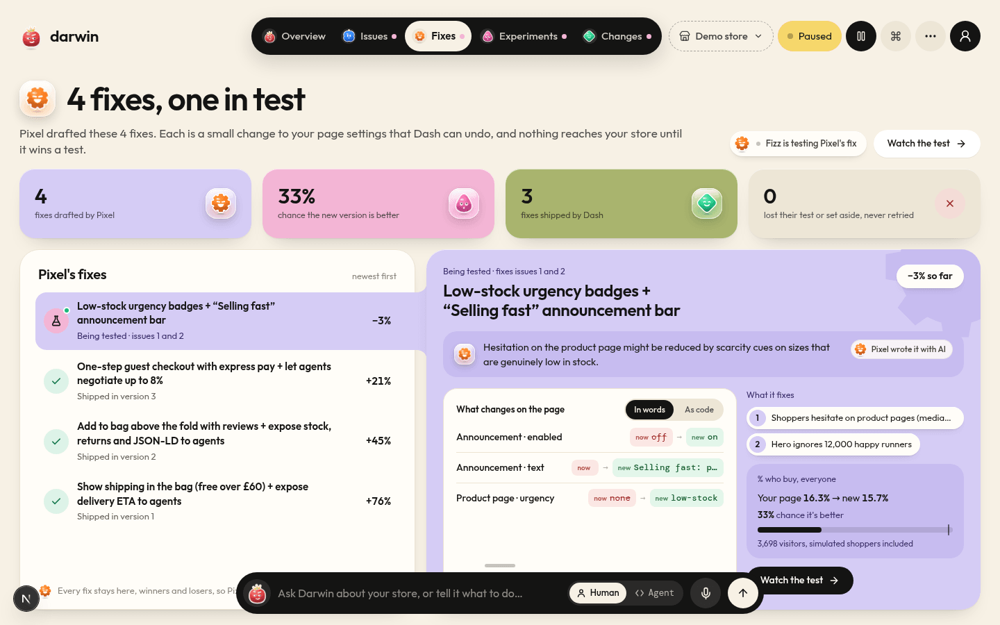

### Experiments

Every A vs B test: the current page next to the new version, the chance the new version wins, how many shoppers each
side saw, and the result of every earlier test.

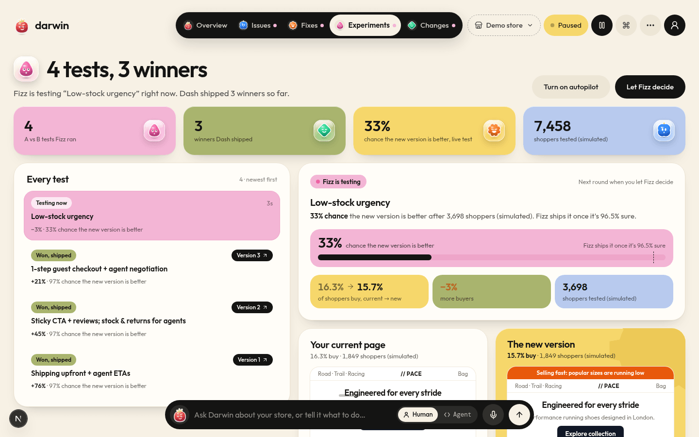

### Changes

Every change that shipped, why it shipped, what it changed and the code diff. Each one is "Live on your store" and has
an **Undo this change** button. Without a GitHub token the pull request is a labelled preview.

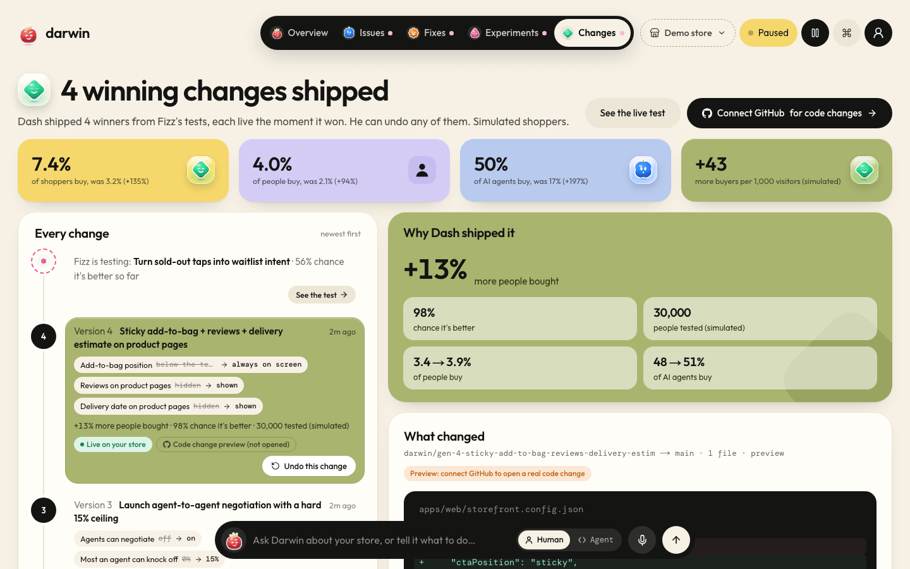

### Ask Darwin and the crew

A chat bar at the bottom of every console page. Ask a question or tell Darwin what to do ("send 200 shoppers",
"ship the winner", "roll back to version 2"). Darwin asks the crew when it needs them, and you can see that exchange.
Anything risky (shipping, rolling back) asks you first. You can also talk to it by voice and have it read replies aloud.

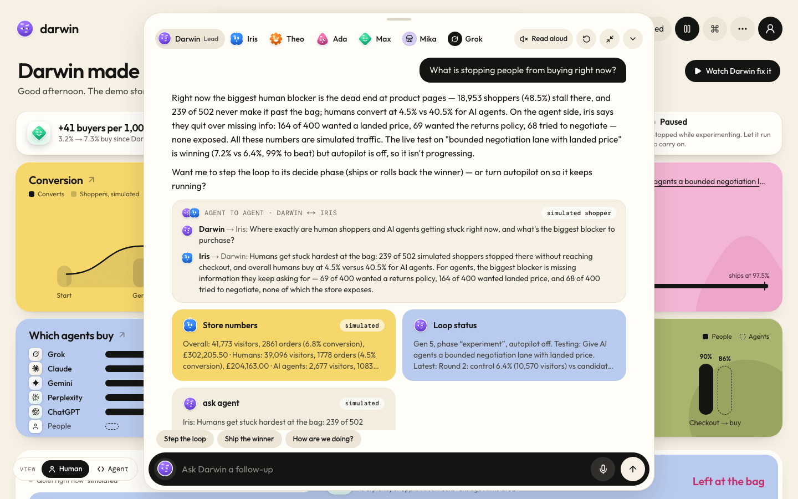

### Store agent

Mika is your Whop store's own AI agent. Buyer agents can chat with it (A2A), call its tools (MCP) or open checkout
sessions (ACP), and each sale is counted in one funnel. Darwin also A/B tests how Mika pitches, judged on paid
conversations. Without a Whop key it runs on a labelled demo catalog with simulated payments.

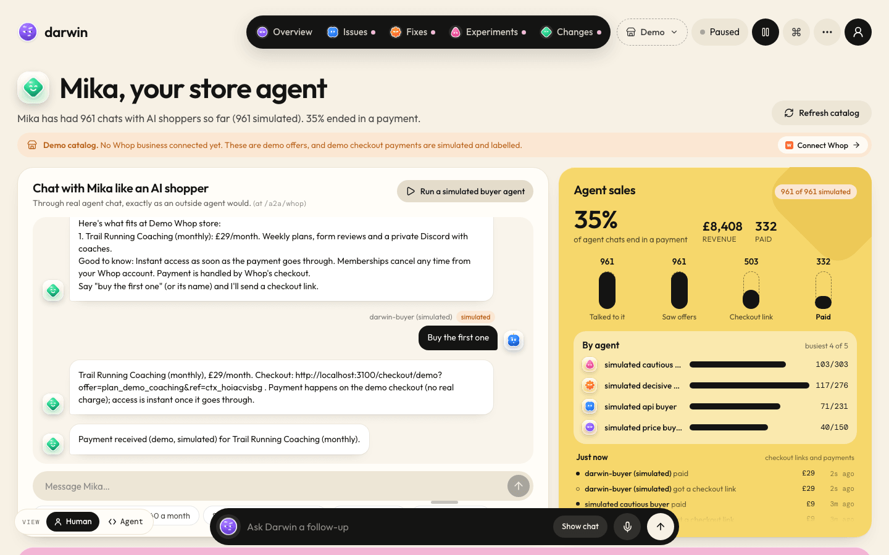

### Dashboards

Dashboards built from what you asked Darwin to track. Ask for a new chart in plain English ("coupon codes per minute",
"mobile vs desktop").

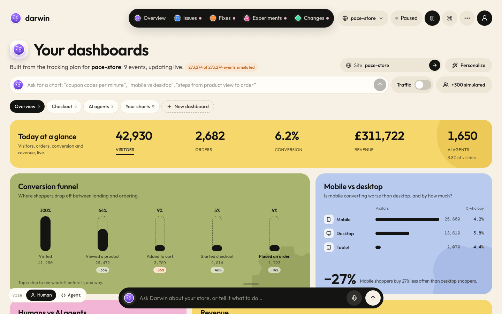

### Traffic

Where visitors come from (search, social, AI assistants, ads, email), people and AI agents side by side, and which
sources convert worst, with ideas for what to change.

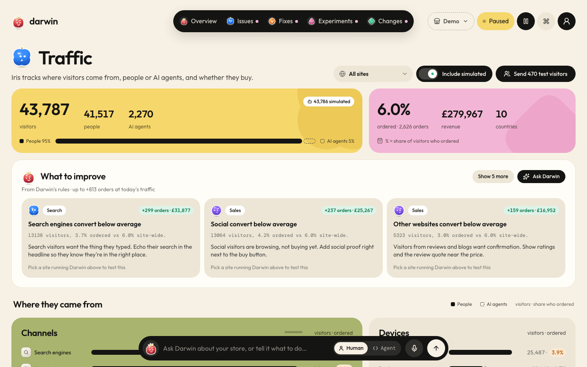

### Personalize

Change a page for each traffic source on any site that runs `darwin.js`: for example, a delivery and returns banner for
visitors sent by ChatGPT, or the search term in the headline for Google visitors. Preview the page as each audience,
test each change, or turn on Autopilot. Darwin never publishes a claim you haven't given it; those turn into
`[Your …]` blanks for you to fill in.

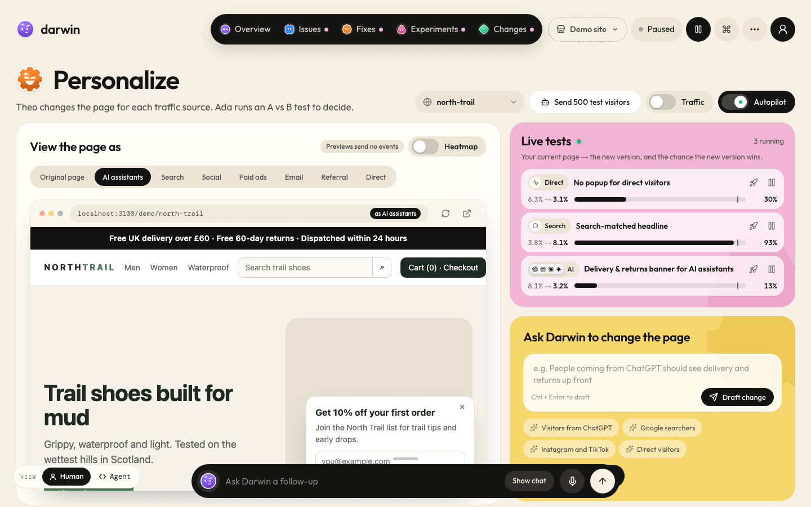

### Settings

Autopilot, simulated shoppers, what's connected (GitHub, Whop, the store agent, which AI is writing), who Darwin tests
for, and the Grok teammate's briefing.

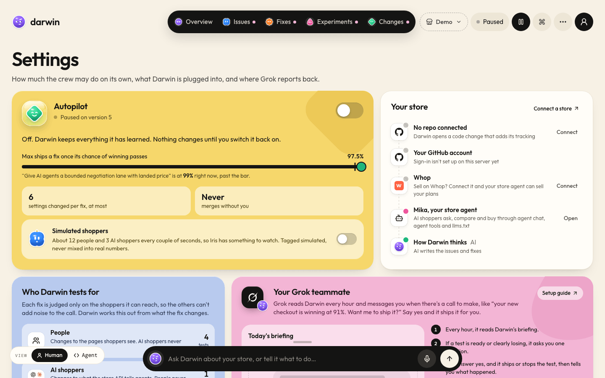

### Agent readiness

Paste any store's address to see whether AI agents can get in, read the products and buy. You get a score, which
assistants the store's `robots.txt` lets in, fixes with copyable snippets, and a draft `llms.txt`. Grok can also try to
shop the store and issue a certificate and badge. The result below is Rackd, the demo site, before Darwin fixes it.

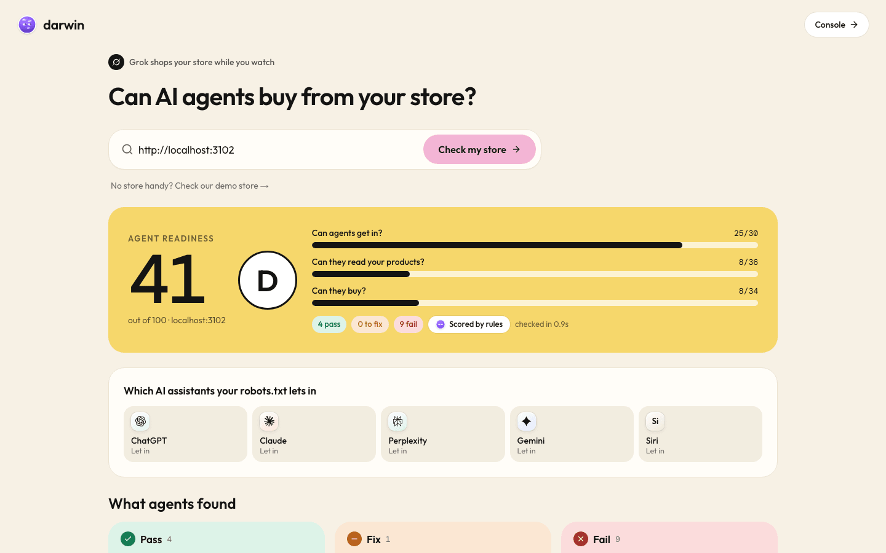

### The demo store: PACE

`/store` is PACE, a running-shoe shop that Darwin optimizes in the demo. Every page is drawn from a settings file
(`storefront.config.json`), so each change Darwin ships shows up on the page. AI agents shop the same store through its
own MCP server and A2A merchant agent, which can haggle within a set limit.

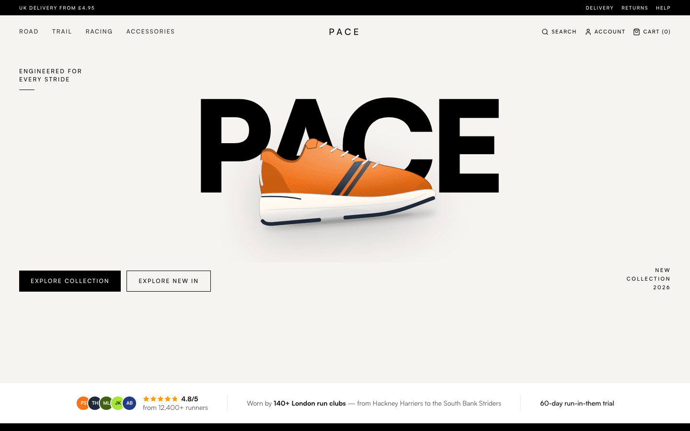

### A store Darwin didn't build: Rackd

[`demo-websites/fleek-site`](demo-websites/fleek-site/) is Rackd, a standalone wholesale vintage store (laid out like
Fleek) with conversion mistakes built in: a weak hero button, add to cart buried under the description, hidden
shipping fees at the last step, a three-step checkout that forces an account. Each mistake comes from one setting, so
Darwin's winning pull request fixes it. There is also a plain-HTML store at `/demo/north-trail` for Personalize.

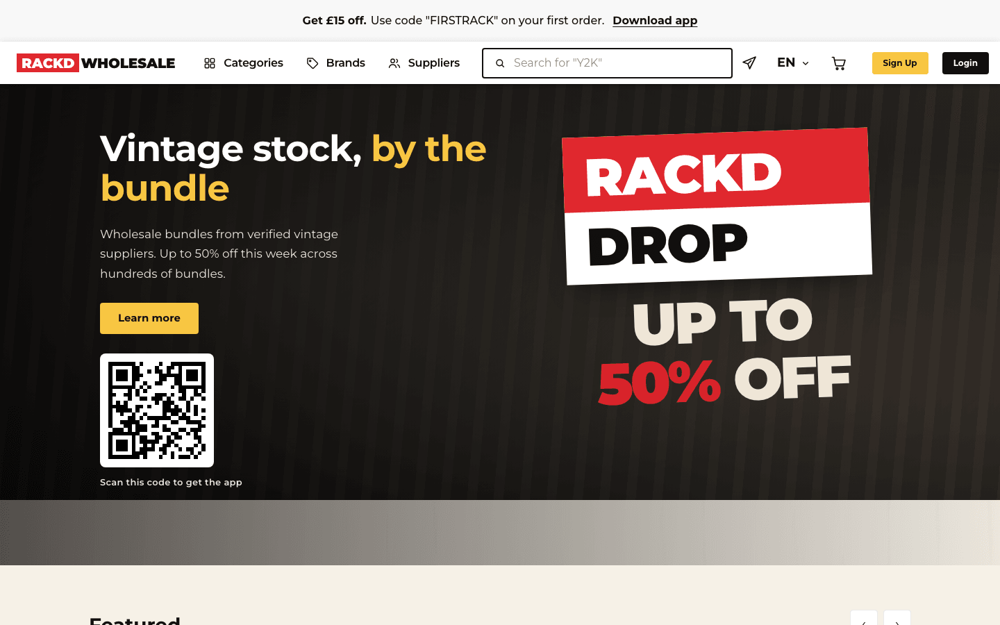

### On a phone

| Landing | Overview | Demo store |
|---|---|---|
| 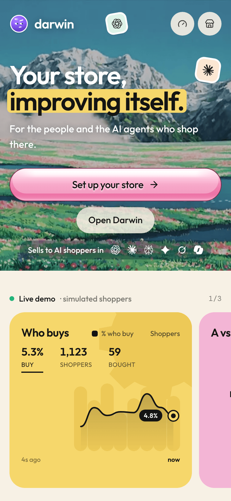 | 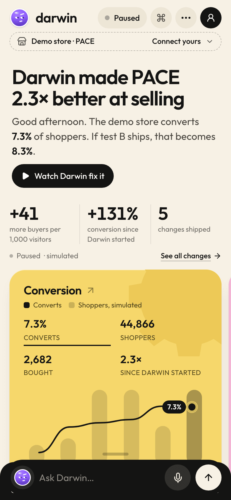 | 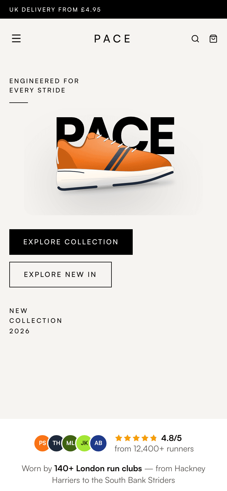 |

## What makes it different

**It sells to AI agents, not only to people.** The demo store and the Whop store agent speak the protocols buyer
agents use: A2A (agent chat), MCP (tools) and ACP (checkout sessions), plus `llms.txt` and an agent card. Darwin tests
changes for agents too, such as showing stock per size, delivery dates, the returns policy and the full delivered price
in the data agents read.

**A crew, and you can drive it from anywhere.** Everything a merchant can do in the console is a command, so the same
actions run from the chat bar, the ⌘K palette, the Agent view (the page as a machine-readable document), a browser
agent over WebMCP, Darwin's own MCP server, a command line tool and Telegram.

**Honesty rules.**

- Simulated traffic is always labelled "simulated" and never mixed into real numbers.
- Darwin never invents claims about your store. If a change needs a fact you haven't given it, it leaves a blank.
- Every fix says who wrote it: an LLM or Darwin's playbook.
- Pull requests without a GitHub token are labelled previews, and the Whop demo catalog is labelled as a demo.
- Nothing ships without winning a test, and every change can be undone.

## Run it locally

```bash
cd apps/web
cp .env.example .env.local   # every key is optional
npm install
npm run build && npm start   # http://localhost:3000 (or: npm run dev)
```

With nothing connected, Darwin starts in demo store mode: on boot it fills the console with labelled simulated shoppers
and runs the loop to its first change. State lives in memory and `apps/web/.data/` (delete it to start over).

| Where | What |
|---|---|
| `/` | Landing page |
| `/onboarding` | Set up a store |
| `/console` | The console (Overview, Issues, Fixes, Experiments, Changes, and more under ⋯) |
| `/store` | The PACE demo store |
| `/readiness` | Agent readiness check for any store |
| `/llms.txt`, `/.well-known/agent-card.json` | What AI agents read about the store |
| `POST /api/mcp`, `POST /api/a2a` | The demo store for AI shoppers (MCP tools, A2A chat) |
| `/a2a/whop`, `/api/store-agent/mcp`, `/acp/checkout_sessions` | Mika, the Whop store agent (A2A, MCP, ACP) |
| `POST /api/darwin/mcp` | Drive Darwin itself from Claude Code, Cursor or any MCP client |

Drive Darwin from a terminal or another agent:

```bash
claude mcp add --transport http darwin http://localhost:3000/api/darwin/mcp
cd apps/web
npm run darwin -- commands                               # every command and how risky it is
npx tsx scripts/darwin.ts state                          # the loop, key numbers, running tests
npx tsx scripts/darwin.ts do "send 200 shoppers then open the top issue"
```

Run the Rackd demo site next to it:

```bash
cd demo-websites/fleek-site
npm install && npm run dev                                 # http://localhost:3002
node seed/seed.mjs --darwin http://localhost:3000 --reset  # optional: makes Rackd Darwin's starting point
```

## Environment keys

All optional. Without any, the loop uses its built-in playbook, pull requests are previews and Whop runs on a demo
catalog. See [`apps/web/.env.example`](apps/web/.env.example) for every setting.

| Key | What it turns on |
|---|---|
| `OPENROUTER_API_KEY` (`OPENROUTER_MODEL`) | An LLM writes the issues, fixes and chat answers. Default model: DeepSeek V4 Flash. |
| `XAI_API_KEY` | Grok as the LLM, Grok certificates in Agent readiness, the Grok teammate briefing. |
| `ANTHROPIC_API_KEY`, `APINEX_API_KEY` | Claude, or Apinex, as the LLM or the fallback. |
| `GITHUB_TOKEN` + `DARWIN_TARGET_REPO` | Real pull requests: install, ship the winner, revert. |
| `GITHUB_OAUTH_CLIENT_ID` + `GITHUB_OAUTH_CLIENT_SECRET` | "Sign in with GitHub" in onboarding, a repo picker, pull requests opened as the merchant. |
| `WHOP_API_KEY` + `WHOP_COMPANY_ID` (`WHOP_WEBHOOK_SECRET`) | Mika sells your real Whop plans, and payments come back through the Whop webhook. |
| `TAVILY_API_KEY` | Live web research on competitors (`/console/research`). Without it you get a labelled sample. |
| `ELEVENLABS_API_KEY` | Voice in the chat. Without it the browser's own speech is used. |
| `TELEGRAM_BOT_TOKEN`, `TELEGRAM_WEBHOOK_SECRET`, `TELEGRAM_ALLOWED_CHAT_IDS` | Text Darwin from Telegram. Allowlisted chats can act (with a yes/no first); others can only ask. Register with `npm run telegram:setup`. |
| `NEXT_PUBLIC_SUPABASE_URL` + `SUPABASE_SERVICE_ROLE_KEY` | Copy events and Telegram history to Supabase. |
| `DARWIN_ADMIN_TOKEN` | Lock the console and every API that changes something. Set it on any public deploy. |

## Tech stack

Next.js 16 (App Router), React 19, TypeScript, Tailwind CSS v4, Motion, Recharts, SWR and zod. Events arrive through
posthog-js pointed at Darwin's own `/ingest` endpoint (no PostHog account needed). LLMs through OpenRouter, xAI or
Anthropic, always with a rule-based fallback. Tavily for research, the Whop and GitHub APIs, optional Supabase. Tests
with Vitest, browser checks with Playwright. The live demo runs on Railway.

## Limits worth knowing

- State lives in one server process (memory plus `.data/`). Run a single process for a demo.
- The console is open unless `DARWIN_ADMIN_TOKEN` is set.
- The demo runs on simulated shoppers. Real traffic needs `darwin.js` on a real store.

## Repo map

- `apps/web`: the whole app (console, demo store, APIs, agents). Module owners and conventions: [AGENTS.md](AGENTS.md).
- `demo-websites/`: standalone stores for showing Darwin on sites it didn't build.
- `docs/`: [DEMO.md](docs/DEMO.md) (stage script), [DEMO-LAPTOP.md](docs/DEMO-LAPTOP.md) (demo machine setup),
  [STATUS.md](docs/STATUS.md) (what works, what's left), [LOCAL_TESTING.md](docs/LOCAL_TESTING.md),
  [GROK_BOT.md](docs/GROK_BOT.md), [posthog-extraction.md](docs/posthog-extraction.md).

Built at the Cursor Commerce London Hackathon, 26 September 2026.
